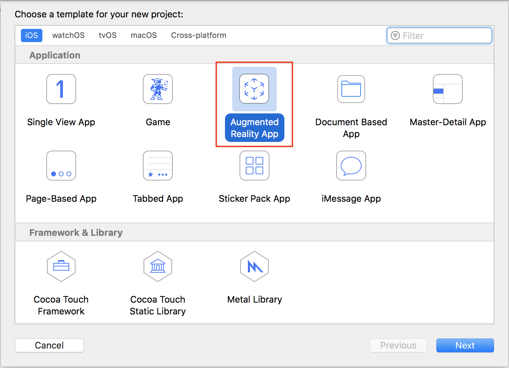
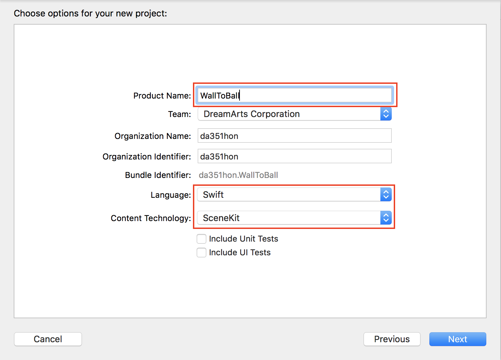
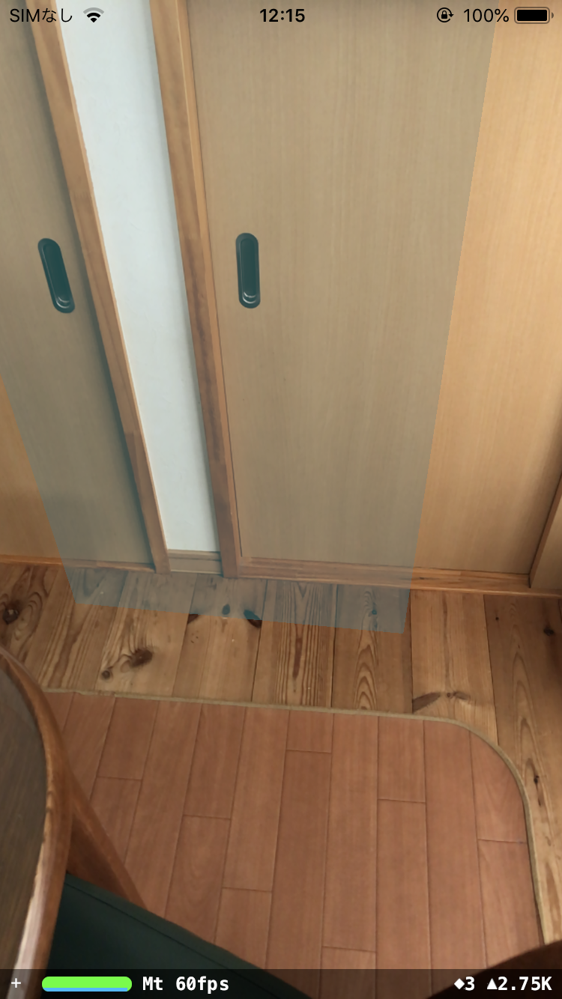

## BallToWall
### 概要
垂直面を認識し、タップした位置から物理演算により球を投げる。
### 作成手順  

1. Xcodeで新規プロジェクトを作成し、「Augmented Reality App」を選択。  
   

2. 任意のプロジェクト名(ここでは「BallToWall」)、Languageは「Swift」、Content Technologyは「SceneKit」を選択。  
SceneKit：簡単に3Dゲームを作ることができるフレームワーク  
  

3. 飛行機を削除し、垂直面認識指定を追加。  
[変更内容](https://github.com/da351hon/BallToWall/commit/6810d770134c071b4b2e5f605a9d8f604986a937)

4. 垂直面検出時に平面を配置、更新する処理を追加。  
[変更内容](https://github.com/da351hon/BallToWall/commit/b86712348f34e75ecb62c33648aadf2cfc60affd)

5. 実行。  
  

6. タップした位置に球を配置する処理を追加。  
[変更内容](https://github.com/da351hon/BallToWall/commit/a630f23b06734f1953358b9ff1fe2468c4d73fc8)

7. 物理演算を追加。  
[変更内容](https://github.com/da351hon/BallToWall/commit/75a98a29f5ffb7894fc79688c962a5ad78b20add)

8. 平面に物理演算を追加。  
[変更内容](https://github.com/da351hon/BallToWall/commit/29f5263f5531a52b96abdddc9799e8530d71145d)

9. 実行  
垂直面検出後に画面をタップすると、ボールが飛んでいき、跳ね返る様子が確認できる。

